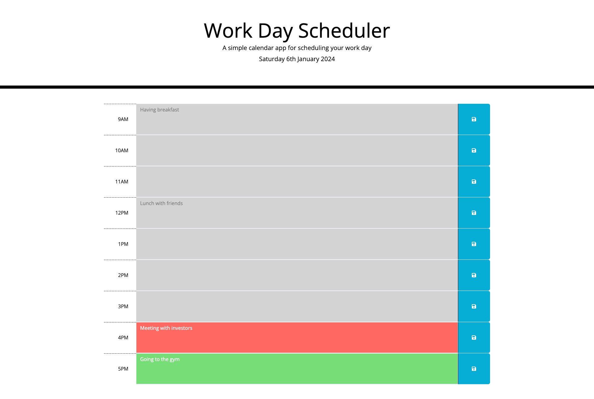

# Work Day Scheduler
Module 7 Challenge for EDX Bootcamp

<!-- TABLE OF CONTENTS -->

  
Table of Contents

  <ol>
    <li>
      <a href="#description">Description</a>
      <ul>
        <li><a href="#built-with">Built With</a></li>
      </ul>
    </li>
    <li>
        <a href="#installation">Installation</a>
    </li>
    <li><a href="#usage">Usage</a></li>
    <li><a href="#license">License</a></li>
    <li><a href="#contact">Contact</a></li>
    <li><a href="#acknowledgments">Acknowledgments</a></li>
  </ol>

<!-- ABOUT THE PROJECT -->
## Description

 
 
This was the 7th homework challenge for the EDX Bootcamp in Front End Development.
 

   
Our task was to create a simple calendar application that allows a user to save events for each hour of the day. This app runs in the browser and features dynamically updated HTML and CSS powered by jQuery.

 

The app also utilises the [Day.js](https://day.js.org/docs/en/display/format) library to work with the current date and time.

### Built With

* 
* 
* 
* 
* 

## Installation

N/A

<!-- USAGE EXAMPLES -->
## Usage

To use this project, please open the website in Chrome or any other web browser. 

At the top of the page you should see today's date.

You will also see that the input fields in each time block are a certain colour depending on the time of day:

* Grey for events in the past
* Red for current events
* Green for future events

You can click into any of the input fields and add some text for an event/appointment. Then can click the save button within the same row to save that event. 

If you refresh the page you should see that the event still persists.

<!-- LICENSE -->
## License

Distributed under the MIT License. See `LICENSE.txt` for more information.

<!-- CONTACT -->
## Contact

Richard Llewellyn - richard.lee.llewellyn@gmail.com 

Project Link: [https://richllew182.github.io/work-day-scheduler/](https://richllew182.github.io/work-day-scheduler/)

Project Repo Link: [https://github.com/RichLlew182/work-day-scheduler](https://github.com/RichLlew182/work-day-scheduler)

<!-- ACKNOWLEDGMENTS -->
## Acknowledgments

* [Jquery](https://api.jquery.com/)
* [Bootstrap](https://getbootstrap.com/docs/5.3/getting-started/introduction/)
* [Img Shields](https://shields.io)
* [Best README Template](https://github.com/othneildrew/Best-README-Template)